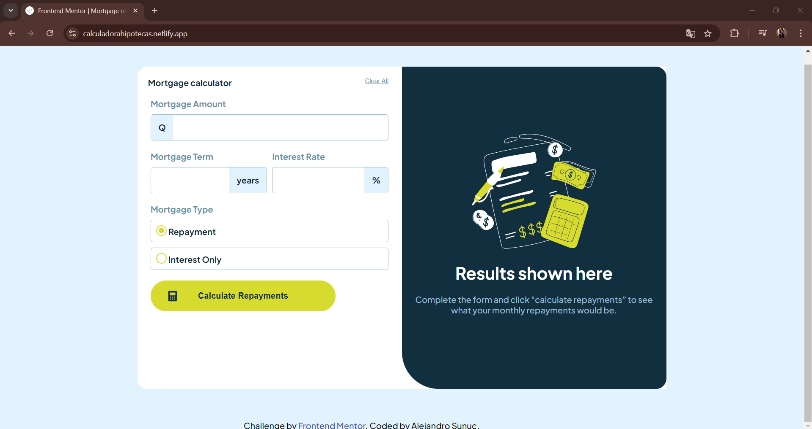

# Frontend Mentor - Mortgage repayment calculator solution

This is a solution to the [Mortgage repayment calculator challenge on Frontend Mentor](https://www.frontendmentor.io/challenges/mortgage-repayment-calculator-Galx1LXK73). Frontend Mentor challenges help you improve your coding skills by building realistic projects. 

## Table of contents

- [Overview](#overview)
  - [The challenge](#the-challenge)
  - [Screenshot](#screenshot)
  - [Links](#links)
- [My process](#my-process)
  - [Built with](#built-with)
  - [What I learned](#what-i-learned)
  - [Continued development](#continued-development)
  - [Useful resources](#useful-resources)
- [Author](#author)
- [Acknowledgments](#acknowledgments)

## Overview

### The challenge

Users should be able to:

- Input mortgage information and see monthly repayment and total repayment amounts after submitting the form
- See form validation messages if any field is incomplete
- Complete the form only using their keyboard
- View the optimal layout for the interface depending on their device's screen size
- See hover and focus states for all interactive elements on the page

### Screenshot

### Links

- Solution URL: [Add solution URL here](https://github.com/AlejandroIMP/mortgage-calculator)
- Live Site URL: [Add live site URL here](https://calculadorahipotecas.netlify.app/)

## My process

### Built with

- Semantic HTML5 markup
- CSS custom properties
- Flexbox
- CSS Grid
- Mobile-first workflow
- SCSS

### What I learned

I have learned a lot about DOM manipulation, 
I have done the solution with pure javascript, which has helped me a lot to practice my logic for DOM manipulation and to use it better. 

The documentation for html, css and javascript has been very helpful, I have been able to practice searching through all the documentation for the relevant information that I need at different times.

### Continued development

I need to keep working and improving my JavaScript, and be able to use it to use libraries and frameworks.

I need to practice by developing more projects, finding new methods and new solutions, and opening my mind to everything that might be possible.

### Useful resources

- [documentation HTML input number](https://developer.mozilla.org/en-US/docs/Web/HTML/Element/input/number) - This helped me for complete all the function of the inputs.
- [Stackoverflow](https://es.stackoverflow.com/questions/467858/como-pasar-el-estado-de-un-radio-button-de-html-a-js#:~:text=javascript%20%2D%20como%20pasar%20el%20estado,Js%20%2D%20Stack%20Overflow%20en%20espa%C3%B1ol) - This answered question has helped me complete a problem in javascript that I didn't know how to solve.

## Author

- Website - [Alejandro Sunuc](https://github.com/AlejandroIMP)
- Frontend Mentor - [@AlejandroIMP](https://www.frontendmentor.io/profile/AlejandroIMP)
- Twitter - [@AlejandroRtw](https://x.com/AlejandroRtw)

## Acknowledgments

I want to thank all the people who have asked their questions on stackoverflow, to be able to find the doubts that I have had and also solve the problems that have put me in a difficult situation.
